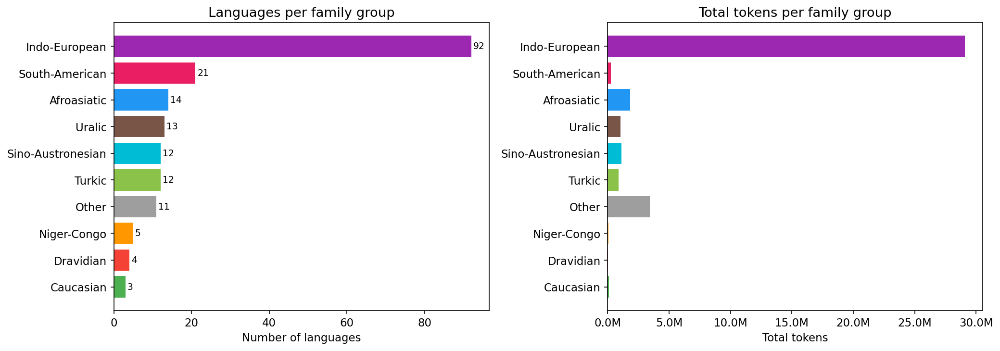
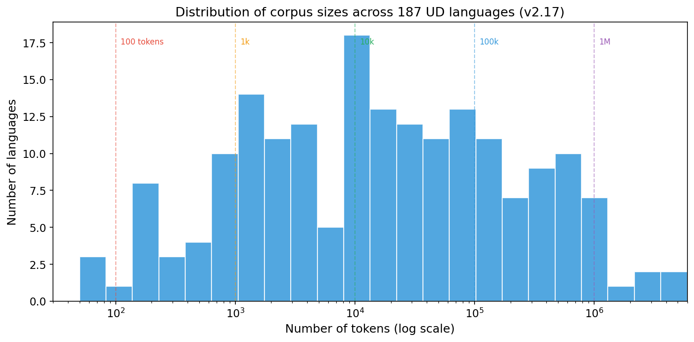
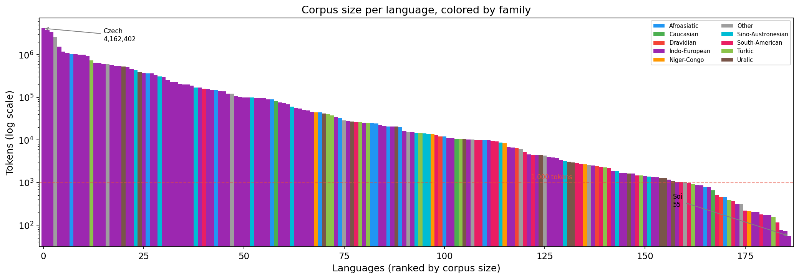
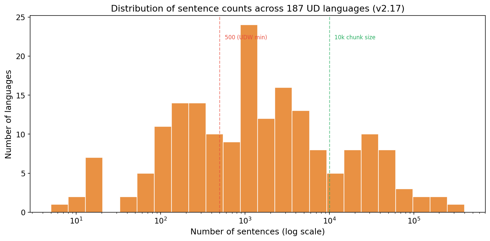
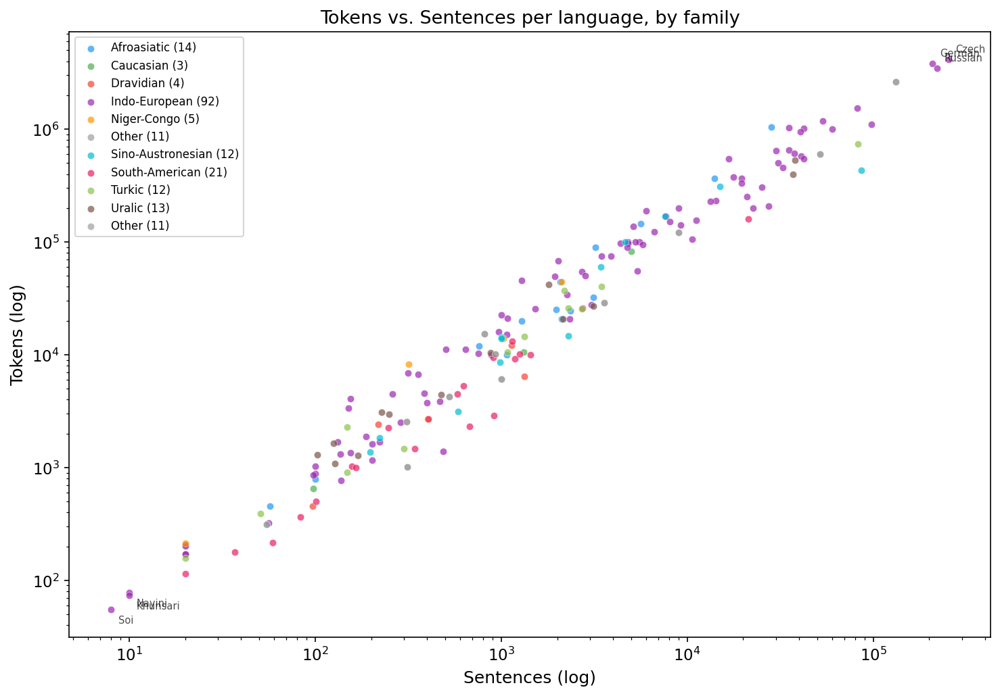
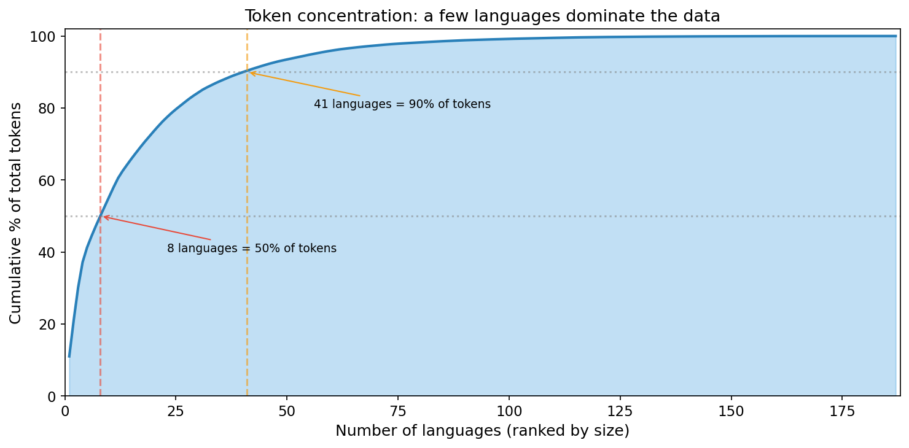
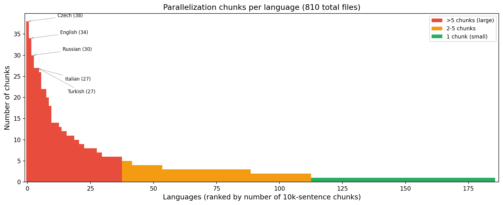
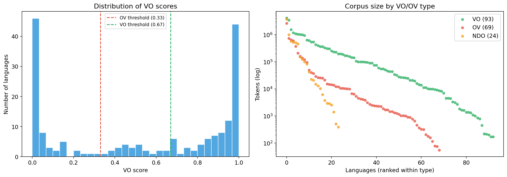

# Comment naviguer dans la mer de treebanks UD : le cas des configurations verbales

Journée Autogramm, 31 mars 2026

**Kim Gerdes (LISN, Université Paris-Saclay)**  
09h45–10h15

Liens :
- Résultats interactifs : https://typometrics.elizia.net/menzerath/
- Code : https://github.com/typometrics/UDW26-Menzerath (CC BY 4.0)

---

## Diapo 1 — Titre & cadrage

- *Comment naviguer dans la mer de treebanks UD : le cas des configurations verbales*
- Kim Gerdes, LISN, Université Paris-Saclay
- Contexte : un programme de recherche sur **plusieurs années**, de l'annotation syntaxique à la typologie quantitative
- La question de comment **généraliser à partir de treebanks** d'une ou de plusieurs langues vers la syntaxe d'une langue, la syntaxe comparative et vers la typologie est à la base même du **projet ANR Autogramm**
- Objectif de cette présentation : **comment exploiter de manière fiable et efficace les 339 treebanks de UD** pour faire de la typologie quantitative ?
- Les résultats concrets de MAL → exposé suivant de Pegah Faghiri : *Contraintes sur la longueur des constituants : loi de Menzerath-Altmann et short-before-long*
- Code et données : https://github.com/typometrics/UDW26-Menzerath | Résultats interactifs : https://typometrics.elizia.net/menzerath/

---

## Diapo 2 — Un programme de recherche sur plusieurs années

- Ce travail s'inscrit dans une série de contributions qui ont construit les outils et les méthodes :
  - mon script conll.py originalement pour la correction de treebanks de Rhapsodie date de 2012 est encore en usage !
  - **SUD** – annotation de surface quasi-isomorphe à UD :
    Gerdes, Guillaume, Kahane & Perrier (2018). *SUD or Surface-Syntactic Universal Dependencies: An annotation scheme near-isomorphic to UD.* UDW 2018.
  - **Typometrics** – des universaux implicationels aux universaux quantitatifs :
    Gerdes, Kahane & Chen (2021). *Typometrics: From implicational to quantitative universals in word order typology.* Glossa 6(1):17.
  - **Flexibilité de l'ordre des mots** – étude typométrique :
    Kahane, Peng & Gerdes (2023). *Word order flexibility: a typometric study.* Depling/SyntaxFest 2023.
  - **Co-effet de MAL et du poids** – premières explorations MAL :
    Chen, Gerdes, Kahane & Courtin (2022). *The co-effect of Menzerath-Altmann law and heavy constituent shift in natural languages.*
  - **Bootstrapping de treebanks** – fiabilité des petits corpus :
    Peng, Gerdes & Guiller (2022). *Pull your treebank up by its own bootstraps.* JJ LIFT-TAL.
- Chaque étape a nécessité de repenser le traitement computationnel de **tous** les treebanks UD/SUD

---

## Diapo 3 — Qu'est-ce qu'une « configuration verbale » ? Deux sens

- Le titre parle de **configurations verbales** — mais ce terme recouvre deux choses différentes selon le projet :
- **Projet typometrics (MAL)** — configuration verbale = la **micro-structure** autour d'un verbe lexical :
  - On prend chaque verbe et ses $n$ dépendants syntaxiques (sujets, objets, obliques…)
  - On filtre agressivement : on exclut `punct`, `discourse`, `parataxis`, `conj`, `cc`, `vocative`, `aux`, `mark`, `case`
  - On ne garde que les **vrais constituants** → on étudie comment leur taille varie avec $n$ (MAL)
  - La configuration est caractérisée par le nombre de constituants à gauche et à droite du verbe
- **Projet UDW 2026 (DLM)** — configuration verbale au sens large = **toute dépendance dans l'arbre** :
  - On regarde toutes les paires (tête, dépendant) de la phrase
  - On classifie chaque arc comme **fonctionnel** (`det`, `case`, `aux`, `mark`, `cop`, `cc`) ou **lexical** (`nsubj`, `obj`, `obl`, `advcl`…)
  - On calcule la longueur de chaque arc (distance en tokens) et on compare à un baseline aléatoire
  - On ne filtre pas de relation : on les **classifie toutes**
- Deux approches complémentaires, deux niveaux de granularité, mais le même enjeu : **extraire des structures de tout UD**

---

## Diapo 4 — La mer de treebanks : UD/SUD 2.17 en chiffres

- **Universal Dependencies v2.17** (novembre 2025) :
  - 339 treebanks
  - 186 langues
  - ~2,3 millions de phrases
  - ~36,4 millions de tokens
- **SUD** (Surface-Syntactic UD) : conversion automatique des mêmes treebanks, annotation de surface plus proche des choix traditionnels en syntaxe
  - SUD est passé de variante expérimentale à un projet parallèle complet : https://surfacesyntacticud.github.io/
- Utilisations précédentes : SUD v2.7, 2.11, 2.12… ; maintenant UD v2.17 (+ SUD v2.17 pour le projet UDW)
- Une ressource inégalée pour la **typologie quantitative**, mais comment l'exploiter sans se noyer ?



---

## Diapo 5 — La distribution extrêmement inégale des treebanks





- Répartition des 186 langues par taille :
  | Taille (tokens) | Langues |
  |---|---|
  | > 1M | 10 (tchèque 4M, allemand 3,7M, russe 3,2M, japonais 2,5M…) |
  | 100k – 1M | 39 |
  | 10k – 100k | 54 |
  | 1k – 10k | 52 |
  | < 1k | 31 (Soi 47 tokens, Khunsari 64, Nayini 68…) |
- Rapport entre la plus grande et la plus petite langue : **4 000 000 / 47 ≈ facteur 85 000**
- Le tchèque a plus de tokens que les 83 plus petites langues réunies




- Nombre de phrases par langue aussi très inégal : Czech 254k phrases vs. Soi 8 phrases

---

## Diapo 6 — Le problème des données : trop et pas assez

- **Trop de données** pour les langues à grandes ressources :
  - Le tchèque : >4 millions de tokens → calculs lourds, temps disproportionné
  - L'arabe NYUAD : des dizaines de milliers de phrases dans le seul fichier train
- **Pas assez de données** pour les petites langues :
  - 31 langues avec < 1 000 tokens, 83 langues avec < 10 000 tokens
  - Soi (47 tokens, 8 phrases), Khunsari (64 tokens), Madi (96 tokens)…
  - Résultats statistiquement fragiles — les langues dont le corpus est si petit qu'aucune statistique n'est fiable
  - Contraste avec les langues **« LOL »** (*Literate, Official, and with Lots of users*) qui, elles, ont des millions de tokens
  - Conséquence : on peut « voir » un résultat qui est en fait du bruit d'échantillonnage
- Défi : trouver un compromis entre **fiabilité statistique** et **couverture typologique maximale**



---

## Diapo 7 — Stratégie 1 : découper et limiter

- **Notre approche (typometrics MAL)** : découper tous les fichiers CoNLL-U en morceaux de **10 000 phrases**
  - `corpus_prep.py → make_shorter_conll_files()`
  - Résultat : **810 fichiers courts** dans `2.17_short/`
  - Petites langues = un seul fichier, grandes langues = multiple fichiers
  - On **garde toutes les données** pour maximiser la fiabilité par langue, mais on découpe pour le parallélisme
  - Certains treebanks exclus manuellement (qualité/pertinence) : ex. `UD_French-PoitevinDIVITAL`, `UD_French-ALTS`
- **Approche UDW 2026** (DLM fonctionnel vs. lexical, https://github.com/typometrics/UDW26) : stratégie différente
  - `MAX_SENTENCES_PER_LANG = 15 000` → **cap dur** par langue
  - `MIN_SENTENCES = 500` → élimine les langues trop petites (retient 122 langues)
  - Trade-off plus agressif : comparabilité inter-langues vs. exhaustivité
  - Avantage : temps de calcul prévisible et homogène par langue



---

## Diapo 8 — Le serveur Calcul et le calcul parallèle

- **Serveur « Calcul » du LISN** : machine partagée avec **80 cœurs CPU** + carte graphique
  - Sert aussi à l'**entraînement de modèles syntaxiques** (parsing) et au fonctionnement de l'**Arborateur** (outil d'annotation en ligne)
  - Nos pipelines typologiques partagent les ressources avec ces autres usages
- **Pipeline typometrics** : `multiprocessing.Pool(psutil.cpu_count())` — tous les cœurs CPU mobilisés
  - Chaque fichier court (≤ 10 000 phrases) = une unité de travail indépendante
  - **Temps de calcul réel :**
    - Préparation / découpage : **~33 secondes**
    - Extraction dépendances + VO/HI + bastards + désordre : **~1 min 15 s** sur 80 cœurs
    - Génération de 2 031 plots : **~14 minutes** sur 80 cœurs
    - Analyse MAL complète : **~2–3 minutes**
  - **Total pipeline : < 25 minutes** pour 186 langues, de la donnée brute aux résultats publiables
- **Pipeline UDW 2026** : sharding (`--shard_id`, `--num_shards`) pour distribuer les langues entre machines
  - Traitement séquentiel par langue dans chaque shard, mais les shards tournent en parallèle
  - Inclut 20 permutations aléatoires par phrase pour le baseline → plus lourd par phrase
  - Traite UD **et** SUD en un seul script
- Sans parallélisme/sharding : les deux pipelines prendraient **des heures**

---

## Diapo 9 — Deux projets, deux complexités de calcul très différentes

- **Projet MAL (typometrics)** — complexité modérée par phrase :
  - Pour chaque verbe : collecter ses $n$ dépendants filtrés, mesurer leurs tailles → $O(n)$ par verbe
  - Pas de baseline aléatoire → pas de permutation
  - Complexité totale ≈ proportionnelle au nombre de tokens
  - **Mais** on extrait 30+ facteurs (MAL, LMAL, RMAL, HCS, désordre, bastards, VO/HI…) → un seul passage mais riche
  - Le goulot d'étranglement est la **visualisation** (2 031 plots) et non l'extraction
- **Projet UDW (DLM)** — complexité plus élevée par phrase :
  - Pour chaque phrase de $k$ tokens : calculer les longueurs de dépendance observées ($O(k)$), **puis** 20 permutations aléatoires des positions ($20 \times O(k)$) → facteur **×20** par phrase
  - Double framework : chaque phrase traitée une fois en UD, une fois en SUD → facteur **×2** supplémentaire
  - Le cap à 15 000 phrases/langue permet de contrôler cette explosion
  - Résultat : le pipeline UDW est plus lourd par phrase mais moins riche en métriques extraites
- **Leçon** : la complexité computationnelle dépend de la **question posée**, pas seulement de la taille des données
- *« Le plus dur ce n'est pas de calculer, c'est de regarder. »*

---

## Diapo 10 — Comparer avec l'approche Grew

- Alternative : utiliser **Grew** (grew-match, grew.fr) pour interroger les treebanks
  - Interface graphique, requêtes par motifs (patterns)
  - Très puissant pour des **requêtes ciblées** sur 1–2 treebanks ou une question précise
  - Grew connaît tous les treebanks → pas besoin de télécharger
- **Mais** pour une étude systématique sur 186 langues × 339 treebanks :
  - Chaque requête interroge le corpus entier → pas de pré-extraction optimisée
  - Pas de parallélisme massif côté utilisateur
  - Difficile d'implémenter notre filtrage fin des dépendants (exclusion de `punct`, `discourse`, `parataxis`, `conj`, `cc`, `vocative`, `aux`, `mark`, `case`…) en une seule requête
  - Notre pipeline pré-extrait **toutes les structures verbales** en un seul passage optimisé → les analyses en aval sont instantanées
- **Complémentarité** : Grew = exploration, validation ponctuelle ; pipeline custom = analyse systématique à grande échelle

---

## Diapo 11 — Ce qu'on extrait concrètement : le pipeline MAL

- Focus : **tous les verbes lexicaux** (pas seulement les verbes principaux)
  - Maximise les données pour les petites langues
  - Chaque verbe → ses dépendants syntaxiques (sujets, objets, obliques, adverbes…)
- **Filtrage fin** : on exclut `punct`, `discourse`, `parataxis`, `conj`, `cc`, `vocative`, `aux`, composés, `mark`, `case`
  - On ne garde que les **vrais constituants syntaxiques** — choix linguistiquement motivé
  - Distinction importante avec Tanaka-Ishii (2021) qui n'excluait que la ponctuation
- Les constituants « bâtards » (extraposition, discontinuité) sont comptés comme constituants séparés
- On mesure la taille (en tokens) de chaque constituant, et on agrège par $n$ (nombre de dépendants) → courbes MAL

---

## Diapo 11b — Pourquoi parcourir les arbres est coûteux

- Pour mesurer la **taille d'un constituant**, il faut compter tous ses descendants dans l'arbre — pas seulement ses enfants directs
- Dans `conll.py`, la fonction `span(i)` est **récursive** :
  ```python
  def span(self, i):
      sp = [i]
      for j in self[i]['kids']:
          sp += self.span(j)
      return sp
  ```
  - Pour chaque nœud $i$, elle descend récursivement dans **tout le sous-arbre** → collecte la liste complète des descendants
- `addspan()` appelle `span(i)` pour **chaque nœud** de l'arbre → complexité $O(n^2)$ dans le pire cas (arbre en chaîne) et $O(n \log n)$ en moyenne
- Ce calcul est fait pour **chaque phrase** de chaque fichier : des millions de phrases × des dizaines de nœuds par phrase
- En plus, quand on active le calcul des « bâtards » (`compute_bastards=True`), `addspan()` fait un deuxième parcours en **post-ordre** (des feuilles vers la racine) pour détecter les constituants discontinus — un `visit()` récursif de plus
- Ensuite, `process_kids()` dans `conll_processing.py` itère sur les dépendants de chaque verbe et consulte `tree[ki]['span']` pour obtenir la taille — la donnée pré-calculée par l'étape récursive
- **Pourquoi pas une approche itérative ?** Le code date de 2012 ; la récursion est naturelle pour les arbres et lisible, mais elle crée des objets Python intermédiaires (listes concaténées) à chaque appel → la pression mémoire du garbage collector est le vrai facteur de ralentissement, plus que la récursion elle-même
- Optimisation possible : calculer les tailles de span en un seul parcours bottom-up en $O(n)$ — mais « ça marche, on n'y touche pas » (la sagesse de l'ingénieur)

---

## Diapo 12 — L'étude MAL : cadrage rapide (résultats → Pegah)

- **Loi de Menzerath-Altmann** : plus une unité a de constituants, plus chaque constituant est court en moyenne
- Innovation de notre étude : analyser séparément les domaines **préverbal** (LMAL) et **postverbal** (RMAL)
- MAL$_n$(L) = taille moyenne des constituants quand il y a exactement $n$ dépendants
- Seuil de fiabilité : **minimum 100 constructions** avec $n$ constituants
- Score VO pour classifier les langues : VO > 0.67, OV < 0.33, NDO entre les deux


- Mesure de l'effet : pente β en régression log-log ; catégorisation en MAL / anti-MAL / zone grise
- **Pour tous les résultats** : voir l'exposé suivant de **Pegah Faghiri** et le site interactif https://typometrics.elizia.net/menzerath/

---

## Diapo 13 — D'abord : trop d'images !

- Première approche exploratoire : **générer toutes les visualisations possibles**
  - 2 031 fichiers PNG dans le dossier `plots/`
  - 8 sous-ensembles de langues × 2 types de plots × 120 combinaisons métriques
  - Plus : bastard analysis, head-init vs factors, VO scores…
- ~14 minutes de calcul parallèle sur 80 cœurs **juste pour les plots** !
- **Problème** : impossible à discuter en groupe de travail
  - 30 facteurs × 180 langues = **5 400 points de données** par graphique
  - Des centaines de graphiques → saturation informationnelle totale
- C'est un problème **général** quand on travaille sur tous les treebanks UD : la masse de résultats dépasse la capacité d'analyse humaine
- 2 031 plots en 14 minutes = ~0,4 seconde par plot. *« On génère des images plus vite qu'on ne peut cligner des yeux — le vrai problème c'est qu'aucun humain ne peut les regarder. »*

---

## Diapo 14 — Comment faire avec nos petits cerveaux ?

- La question centrale : **comment comprendre des masses de données multi-dimensionnelles ?**
- 30 facteurs × 180 langues × 3 directions (bilatéral, gauche, droite) → explosion combinatoire
- Solutions adoptées :
  1. **Sélection de métriques clés** : réduire de 30 facteurs à 3–4 métriques principales
  2. **Catégorisation** plutôt que valeurs continues : MAL / anti-MAL / zone grise (seuils à ±0.1)
  3. **Sous-groupes typologiques** : VO / OV / NDO, IE / non-IE → résultats par groupe, pas par langue
  4. **Mini-plots par langue** : sparklines dans un tableau → balayage visuel rapide
  5. **Site interactif** : https://typometrics.elizia.net/menzerath/ → tri, filtrage, exploration à la demande
  6. **Choix éditoriaux** : quelle question exactement veut-on poser ? → adapter la visualisation
- *« L'intelligence artificielle excelle à calculer 30 facteurs × 180 langues. L'intelligence naturelle excelle à décider lesquels sont intéressants. »*

---

## Diapo 15 — Comment choisir les couleurs ?

- Problème récurrent en visualisation typologique :
  - 10+ familles de langues, 3 types VO/OV/NDO, catégories MAL…
  - Les palettes standard (viridis, Set2) ne suffisent pas toujours
- Notre approche :
  - Couleurs de familles de langues : stockées dans le Google Sheet de métadonnées (une couleur par famille, maintenue au fil des versions UD)
  - Couleurs sémiologiques pour les catégories : **vert** (conforme/MAL), **rouge** (déviant/anti-MAL), **orange** (zone grise), **bleu** (informatif)
- Clé : la couleur doit être **sémiologiquement motivée** → intuition immédiate, pas besoin de consulter la légende
- Sur le site interactif : chaque couleur correspond à une valeur triable → ergonomie de l'exploration

---

## Diapo 16 — Regroupements linguistiques : satisfaire tout le monde ?

- On regroupe par **familles de langues** (IE vs. non-IE) et **type d'ordre** (VO, OV, NDO)
- Avantage : résultats plus **robustes** — plus de données par groupe, moins de bruit par langue individuelle
- Difficulté : **impossible de contenter tout le monde**
  - Les groupements WALS (Feature 83A) ne correspondent pas toujours à nos catégories automatiques
  - Les langues « sans ordre dominant » (NDO) sont un groupe particulièrement hétérogène
  - Les familles avec 1–3 langues : difficile de tirer des conclusions
- Stratégie : montrer les **tendances par groupe** + permettre le **zoom sur les exceptions** (site interactif)
- Question ouverte : quels regroupements sont les plus informatifs pour quelle question ?

---

## Diapo 17 — Ordonnancement : tableau statique vs. site interactif

- **Article** (Appendice A) : tableau de mini-plots par langue, ordre éditorial (par famille, par β décroissant)
  - Choix éditoriaux inévitables → un seul ordonnancement figé
  - Le lecteur est « guidé » mais ne peut pas explorer sa propre question
- **Site dynamique** (https://typometrics.elizia.net/menzerath/) :
  - Tri par n'importe quelle colonne : β, compliance, score VO, famille…
  - Beaucoup plus naturel pour l'exploration : chaque chercheur explore **sa** question
- Les 2 031 plots : pas publiés dans l'article, mais accessibles en archives pour l'exploration interne
- **Leçon** : pour les études typologiques à grande échelle, un site interactif devrait être une publication complémentaire systématique

---

## Diapo 18 — Au-delà des couleurs : quels outils pour visualiser 180 langues ?

- **Ordonnées manuelles** dans les tableaux → travail considérable, choix subjectifs
- Alternative rêvée : un site de type « tableau de bord typologique »
  - Filtrer par famille, par propriété typologique, par taille de corpus
  - Accéder aux exemples de phrases sous-jacents en un clic
  - Comparer visuellement les courbes de plusieurs langues côte à côte
- En pratique : HTML généré automatiquement à partir du pipeline (on génère déjà des rapports HTML : `mal_analysis_report.html`, `UD_maps.html`, exemples de configurations…)
- L'ergonomie de l'interaction homme-données est un **goulot d'étranglement** sous-estimé dans les études computationnelles de grande échelle

---

## Diapo 19 — Cas d'étude 2 : Functional vs. Lexical DLM (UDW 2026)

- Un **deuxième pipeline** pour une question différente sur les mêmes données : https://github.com/typometrics/UDW26
  - *The Grammar Does the Work: Functional vs. Lexical Dependency Length Minimization Across Universal Dependencies*
- Paramètres : `MIN_SENTENCES = 500`, `MAX_SENTENCES_PER_LANG = 15 000`, `N_PERMUTATIONS = 20`
- Différences architecturales avec le pipeline MAL :
  - Pas de découpage en fichiers courts mais un **cap dur** à 15 000 phrases
  - Parallélisme par **sharding** (répartition des langues) plutôt que par `multiprocessing.Pool`
  - Traitement simultané de **UD et SUD** → classification fonctionnel/lexical adaptée à chaque schéma
  - Relations classifiées en **fonctionnelles** (`det`, `case`, `aux`, `mark`, `cop`, `cc`) vs. **lexicales** (`nsubj`, `obj`, `obl`, `advcl`…) — une inversion par rapport à SUD où les mots fonctionnels sont tête
- Même défi fondamental : naviguer dans 186 langues × 2 frameworks × N métriques
- Code MAL : https://github.com/typometrics/UDW26-Menzerath | Code DLM : https://github.com/typometrics/UDW26

---

## Diapo 20 — Au-delà de MAL : que faire d'autre avec toutes ces données ?

- Le pipeline typometrics extrait bien plus que MAL :
  - **Head-initiality / score VO** → classifier automatiquement l'ordre de base des langues
  - **HCS** (Hierarchical Complexity Score) → facteurs de croissance entre positions de dépendants
  - **Désordre des constituants** → violations de l'ordre monotone
  - **Dépendances bâtardes** → mesure de la discontinuité syntaxique
- Chacun de ces axes ouvre des questions typologiques :
  - Lien entre **minimisation de longueur des dépendances** (DLM) et MAL
  - Structure informationnelle → constituants topicaux (courts, proches du verbe) vs. focaux (longs, éloignés)
  - Quelles propriétés sont des **universaux** et lesquelles sont des **préférences** ?
- À chaque nouvelle question, le même défi computationnel et cognitif : tout recalculer, tout re-visualiser, tout réinterpréter

---

## Diapo 21 — Difficultés générales de la typologie computationnelle sur UD

- **Hétérogénéité des annotations** : mêmes relations, conventions différentes entre treebanks (ex. traitement des composés, des expressions figées)
- **Biais d'échantillonnage** : surreprésentation de langues européennes à grandes ressources → biais IE
- **Choix de la granularité** : par treebank ? par langue (en agrégeant les treebanks) ? par famille ? → chaque niveau donne des résultats légèrement différents
- **Reproductibilité** : besoin de pipelines versionnés (code + données + paramètres) → GitHub, pickle, CSV
- **UD vs. SUD** : les différences d'annotation peuvent changer les résultats (ex. la direction des arcs fonctionnels) → nécessité de comparer les deux
- **Mise à jour continue** : chaque nouvelle version UD peut modifier les résultats → automatiser le pipeline

---

## Diapo 22 — Leçons pour naviguer dans la mer de treebanks

- **Sept leçons méthodologiques :**
  1. Découper les corpus en morceaux exploitables (10 000 / 15 000 phrases) → gérer l'asymétrie de taille
  2. Paralléliser massivement (80 cœurs, sharding) → minutes au lieu d'heures
  3. Pré-extraire les structures d'intérêt en un seul passage optimisé plutôt que des requêtes ad hoc
  4. Filtrer linguistiquement les dépendants non pertinents → des choix motivés, pas un traitement brut
  5. Poser des seuils de fiabilité (≥ 100 occurrences, ≥ 500 phrases) → accepter de perdre des langues
  6. Catégoriser + visualiser de manière interactive → les tableaux statiques ne suffisent plus
  7. Valider par sous-groupes (familles, types d'ordre) → robustesse des généralisations
- **Complémentarité des outils** : Grew pour l'exploration rapide, pipelines custom pour l'analyse systématique, sites interactifs pour la diffusion

---

## Diapo 23 — Perspectives

- **Automatisation** : pipeline entièrement reproductible pour chaque nouvelle version UD/SUD (v2.18, v2.19…)
- **Double regard UD/SUD** : le projet UDW 2026 montre que les résultats peuvent différer entre schémas → les comparer systématiquement
- **Ergonomie** : vers un « tableau de bord typologique » interactif comme compagnon standard des publications
- **Intégration Grew** : validation croisée des résultats de pipeline avec des requêtes Grew ciblées ; la nouvelle API Python de Grew (`grewpy`) pourrait rapprocher exploration interactive et pipeline systématique
- **Des données aux théories** : comment les résultats quantitatifs contraignent-ils les modèles syntaxiques, psycholinguistiques, et typologiques ?
- **→ Résultats concrets de MAL** : exposé suivant de **Pegah Faghiri**, *Contraintes sur la longueur des constituants : loi de Menzerath-Altmann et short-before-long*

---

### Notes complémentaires pour l'oral

- **Durée** : 30 min → ~65–75 secondes par diapo, prévoir 5 min de discussion
- **Transition vers Pegah** : « Je laisse à Pegah le soin de vous montrer les résultats, qui sont remarquables. »
- **Démos live possibles** : montrer le site typometrics.elizia.net en direct, naviguer dans les tris ; montrer le repo GitHub UDW26
- **Questions anticipées** :
  - Pourquoi UD et pas SUD ? → UD plus standard, mais SUD comparé dans le projet UDW
  - Pourquoi pas Grew directement ? → complémentarité, pas opposition ; pour 186 langues le pipeline custom est indispensable
  - Pourquoi ne pas utiliser des LLMs pour classifier ? → les treebanks annotés manuellement restent la référence, pas de bruit stochastique
- **Fil rouge narratif** : partir de la masse brute (339 treebanks, ~36M tokens) → montrer les défis computationnels et cognitifs → les stratégies mises en place → ouvrir sur la présentation des résultats par Pegah
